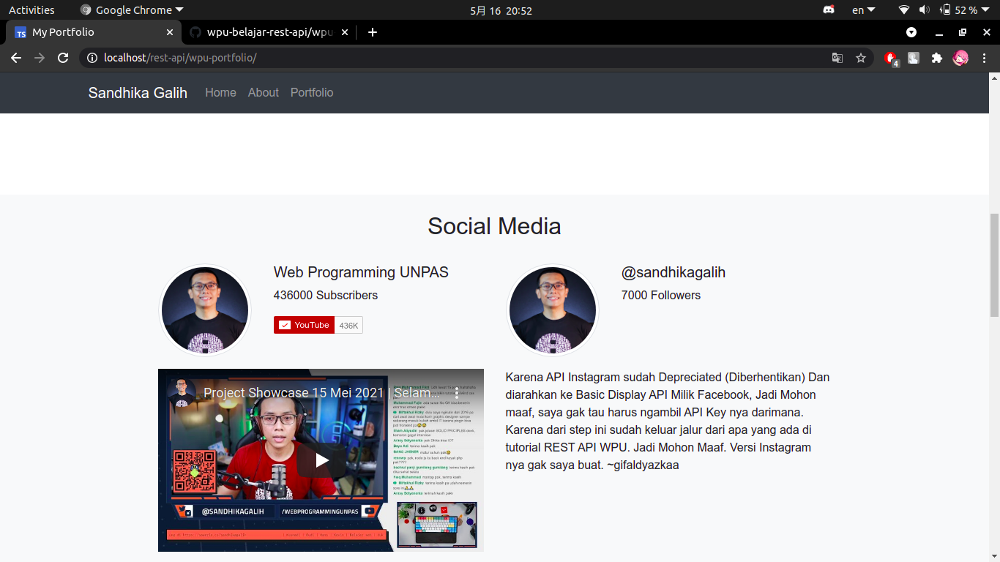

# #6 - Youtube & Instagram API (Menggunakan cURL)
Hasil Implementasi dari Video REST API Part #6.

## Kok Gak ada Instagram API?
- Karena Instagram sudah Dibeli Facebook, dan ketika saya mencoba daftar di instagram.com/developers , Ternyata sudah gak bisa, dan kalau bisa pun akan diarahkan ke Basic Display API milik Facebook dan Cara mendapatkan API Key nya akan lebih sulit. Jadi, Mohon maaf, mungkin ini akibat keterlambatan saya belajar Coding. Tutorial nya dibuat tahun 2018, Sedangkan saya belajar menggunakan Playlist itu di tahun 2021 :) Jadi, maafkan kesalahan saya ini :)

## Note
- Kalau ngerti Cara ganti YouTube API, Disarankan pakai API Key sendiri. Custom ID Channelnya juga boleh kok. Kan gak ada salahnya kalau pake API Key Sendiri. Right?
